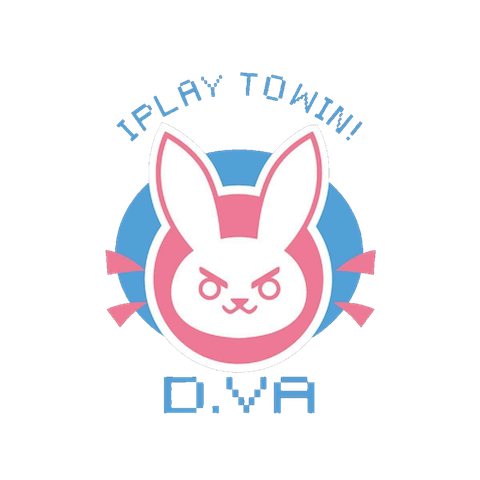

<h1 align="center"> I LOVE D.VA </h1>

  

 

*图片、标题与项目无关*

## 项目介绍

一个基于Node.Js的博客系统，开发中，有兴趣一起搞事情的大佬请联系lsh934960645@163.com

## 项目技术栈

* [TypeScript](https://www.typescriptlang.org/)
* [Koa2](http://koajs.com/)
* [MongoDB](https://docs.mongodb.com/manual/installation/?jmp=footer&_ga=2.37828070.497966747.1524038808-1016953151.1524038808)

## 项目环境搭建

就现阶段来说clone到本地以后直接yarn一下就好了，推荐使用yarn！npm不一定装的下。
